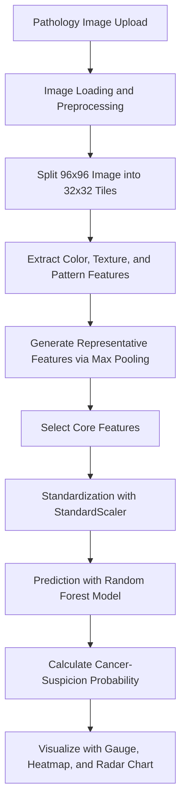

# PathoCancerAI


## 1. Project Overview

**PathoCancerAI** is a machine learning-based web application that predicts whether a lymph node histopathology image patch is likely to contain metastatic cancer tissue.

When a user uploads a 96×96 pixel pathology image patch (`.tif`, `.png`, or `.jpg`), the system extracts color, texture, and fine-pattern features from the image. It then uses a trained Random Forest model to calculate the probability that the tissue is suspicious for cancer. The prediction results are visualized in the Streamlit web interface using a risk gauge, key-feature charts, a regional risk heatmap, and a radar chart.

> ⚠️ This project is a research and educational prototype. It is not intended for clinical diagnosis, treatment decisions, or medical judgment. Final interpretation must always be reviewed by qualified medical professionals, such as pathologists.

---

## 2. Project Topic

- **Project title**: Prediction of Metastatic Cancer Tissue Using Lymph Node Data
- **Analysis target**: Lymph node histopathology image patches
- **Prediction task**: Binary classification of normal tissue and metastatic cancer tissue
- **Input data**: 96×96 pixel RGB pathology images
- **Output result**: Cancer-suspicion probability and normal/cancer-suspicious classification
- **Model approach**: Random Forest classifier based on handcrafted image feature extraction

---

## 3. Key Features

### Image Upload and Analysis

- Upload pathology images in `.tif`, `.png`, or `.jpg` format
- Split a 96×96 image patch into 32×32 tiles
- Exclude background regions and extract features mainly from tissue-containing regions
- Aggregate tile-level features using a max-pooling strategy

### Feature Extraction

- RGB color features
- HSV color-space features
- LAB color-space features
- GLCM-based texture features
- LBP-based local pattern features

### Model Prediction

- Standardize input features using `StandardScaler`
- Use only the selected core features as model input
- Estimate cancer-suspicion probability using a Random Forest model
- Classify the image as normal or cancer-suspicious based on a probability threshold

### Visualization

- Cancer risk gauge chart
- Key-feature bar chart
- Regional heatmap based on nine image regions
- Radar chart comparing the current image with normal and cancer-reference patterns
- Detailed interpretation report for each indicator

---

## 4. Dataset

This project is based on the Kaggle **Histopathologic Cancer Detection** dataset.

- Data type: Lymph node histopathology image patches
- Image size: 96×96 pixels
- Image channels: RGB
- File format: `.tif`
- Label structure:
  - `0`: Normal tissue
  - `1`: Metastatic cancer tissue
- Dataset size: Approximately 220,000 image patches

The dataset itself is not included in this repository. Users must check and comply with the Kaggle dataset terms of use and license before using the data.

---

## 5. Analysis Pipeline



---

## 6. Feature Extraction Method

### 6.1 Color Features

The image is analyzed in RGB, HSV, and LAB color spaces, and the mean and standard deviation of each channel are calculated. In histopathology images, color distributions may vary depending on staining quality and tissue composition. Therefore, color-based features are used to capture abnormal staining patterns or changes in nuclear density that may be associated with cancer tissue.

Example features:

| Feature | Meaning |
|---|---|
| `R_mean`, `G_mean`, `B_mean` | Mean value of each RGB channel |
| `R_std`, `G_std`, `B_std` | Standard deviation of each RGB channel |
| `H_mean`, `S_mean`, `V_mean` | Mean value of each HSV channel |
| `H_std`, `S_std`, `V_std` | Standard deviation of each HSV channel |
| `L_mean`, `A_mean`, `B_mean` | Mean value of each LAB channel |
| `L_std`, `A_std`, `B_std` | Standard deviation of each LAB channel |

### 6.2 Texture Features

GLCM, or Gray-Level Co-occurrence Matrix, is used to calculate textural characteristics of the tissue. Since cancer tissue can show more irregular structural patterns than normal tissue, texture contrast and homogeneity can serve as important discriminative indicators.

| Feature | Meaning |
|---|---|
| `GLCM_Contrast` | Brightness difference between pixels and texture contrast |
| `GLCM_Homogeneity` | Uniformity of tissue texture |
| `GLCM_Energy` | Regularity and energy of texture patterns |
| `GLCM_Correlation` | Correlation between neighboring pixels |

### 6.3 Pattern Features

LBP, or Local Binary Pattern, is used to quantify local fine patterns in cells and tissue. This method converts subtle morphological differences that are difficult to distinguish visually into numerical model inputs.

Example features:

- `LBP_0 ~ 9`

---

## 7. Final Core Indicators

According to the project report, the following major features were used for metastatic cancer prediction after removing multicollinearity.

| Core Indicator | Description |
|---|---|
| `H_std` | Standard deviation of the Hue channel in HSV color space; represents variation in color tone |
| `B_std` | Standard deviation of the B channel in LAB color space; represents variation in color intensity |
| `GLCM_Contrast` | Reflects contrast and irregularity in tissue texture |
| `GLCM_Energy` | Reflects uniformity and regularity of tissue texture |
| `LBP_4` | Fine morphological feature based on local binary patterns |

In the actual application, the selected feature indices stored in `selected_features.pkl` are loaded and used as model inputs.

---

## 8. Model Training Overview

This project does not directly apply deep learning to raw images. Instead, it extracts quantitative features from pathology image patches and trains a traditional machine learning model.

The overall training workflow is as follows.

1. Load image files and label metadata
2. Extract 32 features from each 96×96 image patch
3. Split the data into train, validation, and test sets
4. Check multicollinearity and remove features based on VIF
5. Standardize features using `StandardScaler`
6. Apply SMOTE to reduce class imbalance
7. Train a Random Forest-based classification model
8. Compare performance on the validation set and tune hyperparameters
9. Evaluate the final model on the test set using confusion matrix, precision, recall, F1-score, and ROC-AUC
10. Optimize the prediction threshold and apply it to the web application

---

## 9. Model Performance and Threshold

Based on the project report, the final model achieved an ROC-AUC of **0.8627**. In the web application, the prediction threshold is set to **0.4380** to classify images as either normal tissue or cancer-suspicious tissue.

| Item | Value |
|---|---|
| Model | Random Forest |
| Preprocessing | StandardScaler |
| Class imbalance handling | SMOTE |
| Main evaluation metrics | ROC-AUC, Precision, Recall, F1-score |
| ROC-AUC | 0.8627 |
| Prediction threshold | 0.4380 |

The classification criteria are as follows.

| Predicted Probability | Classification |
|---|---|
| `prob > 0.4380` | Suspicious for cancer tissue |
| `prob <= 0.4380` | More likely normal tissue |

---

## 10. Web Application 

The picture below shows example outputs from the Streamlit web application. It includes both a cancer-suspicious prediction result and a normal-tissue prediction result. This section is useful for quickly showing how the uploaded pathology image, cancer-suspicion probability, prediction result, key-feature analysis, and detailed interpretation report are presented to the user.


<table align="center">
  <tr>
    <td align="center" width="50%">
      
      <br>
      <b>Cancer Tissue AI Prediction Result and Probability</b>
    </td>
    <td align="center" width="50%">
      
      <br>
      <b>Normal Tissue AI Prediction Result and Probability</b>
    </td>
  </tr>
  <tr>
    <td align="center" width="50%">
      
      <br>
      <b>Cancer Tissue AI Description Report</b>
    </td>
    <td align="center" width="50%">
      
      <br>
      <b>Normal Tissue AI Description Report</b>
    </td>
  </tr>
</table>

---

## 11. Web Application Interface

The Streamlit application consists of the following interface components.

| Component | Description |
|---|---|
| Image upload | Upload a pathology tissue image for analysis |
| Original image display | Display the uploaded pathology image |
| Prediction result | Show whether the image is likely normal or suspicious for cancer tissue |
| Risk gauge chart | Visualize cancer-suspicion probability on a 0–100% scale |
| Key-feature bar chart | Display normalized values of selected core features |
| Regional heatmap | Divide the 96×96 image into nine regions and show regional risk patterns |
| Radar chart | Compare the current image pattern with normal and cancer-reference patterns |
| Detailed report | Interpret indicators such as `H_std`, `B_std`, `GLCM_Contrast`, `GLCM_Energy`, and `LBP_4` |

---

## 12. Project File Structure

The repository structure is shown below.

```text
PathoCancerAI/
├── README.md
├── app.py
├── requirements.txt
├── final_rf_model.pkl
├── scaler.pkl
├── selected_features.pkl
├── .gitignore
└── LICENSE
```

---

## 13. File Descriptions

| File | Description |
|---|---|
| `README.md` | Documentation containing project overview, installation, usage, and model description |
| `app.py` | Streamlit-based web application for pathology image analysis |
| `requirements.txt` | List of Python packages required to run the project |
| `final_rf_model.pkl` | Trained Random Forest model file |
| `scaler.pkl` | `StandardScaler` object used to standardize model input features |
| `selected_features.pkl` | File containing indices of the final selected features |
| `.gitignore` | Configuration file specifying files and folders excluded from Git tracking |
| `LICENSE` | Open-source license file |

---

## 14. Installation

### 14.1 Clone the Repository

```bash
git clone https://github.com/jechoi2026-00/PathoCancerAI.git
cd PathoCancerAI
```

### 14.2 Create a Virtual Environment

For Windows PowerShell:

```bash
python -m venv .venv
.venv\Scripts\activate
```

For macOS or Linux:

```bash
python -m venv .venv
source .venv/bin/activate
```

### 14.3 Install Dependencies

```bash
pip install -r requirements.txt
```

If `requirements.txt` is not available, install the required packages manually.

```bash
pip install streamlit opencv-python-headless numpy pandas joblib plotly scikit-image scikit-learn imbalanced-learn
```

---

## 15. How to Run

Run the following command to start the Streamlit web application.

```bash
streamlit run app.py
```

After running the command, open the local Streamlit page in your browser and upload a pathology image for analysis.

The default local address is usually:

```text
http://localhost:8501
```

---

## 16. How to Use

1. Run the Streamlit application.
2. Upload an image through the section labeled `Upload a 96x96 tissue image (.tif, .png, .jpg) for diagnosis.`
3. The app loads the image in BGR/RGB format and splits it into 32×32 tiles.
4. Color, texture, and pattern features are extracted from each tile.
5. Only the selected features are retained and standardized using `scaler.pkl`.
6. The `final_rf_model.pkl` model predicts the cancer-suspicion probability.
7. Check the classification result and risk visualizations on the result page.

---

## 17. Main Code Logic

### 17.1 Extracting 32 Features

The `get_32_features()` function extracts 32 features related to color, texture, and local patterns from a 32×32 image patch.

```python
def get_32_features(patch):
    """Extract 32 features from a 32x32 patch, including color, texture, and pattern features."""
```

The extracted features are grouped into three main categories.

- RGB, HSV, and LAB color features
- GLCM-based texture features
- LBP-based local pattern features

### 17.2 Analyzing a 96×96 Image

The `extract_logic_96x96()` function divides a 96×96 image into nine 32×32 tiles, excludes background regions, extracts tile-level features, and applies max pooling.

```python
def extract_logic_96x96(img_bgr):
    """Analyze a 96x96 image by splitting it into 32x32 tiles and applying max pooling."""
```

### 17.3 Loading the Model and Preprocessing Objects

The application loads the following three files.

```python
model = joblib.load('final_rf_model.pkl')
scaler = joblib.load('scaler.pkl')
selected_indices = joblib.load('selected_features.pkl')
```

### 17.4 Running Prediction

```python
features_32 = extract_logic_96x96(img_bgr)
features_5 = features_32[selected_indices].reshape(1, -1)
input_scaled = scaler.transform(features_5)
prob = model.predict_proba(input_scaled)[0][1]
threshold = 0.4380
```

---

## 18. Tech Stack

| Category | Technology |
|---|---|
| Language | Python |
| Web App | Streamlit |
| Image Processing | OpenCV |
| Feature Extraction | scikit-image |
| Machine Learning | scikit-learn Random Forest |
| Imbalance Handling | SMOTE |
| Data Processing | NumPy, pandas |
| Model Serialization | joblib |
| Visualization | Plotly |
| Dataset | Kaggle Histopathologic Cancer Detection |

---

## 19. Limitations

- The current model is a research prototype and is not intended for clinical diagnosis.
- The model assumes that input images are 96×96 pixels. Images of other sizes require additional resizing or tiling preprocessing.
- Prediction results may vary depending on staining condition, scanner quality, and tissue section quality.
- The model is optimized for patch-level analysis. To analyze whole-slide images (WSI) in real time, an additional tiling pipeline is required.
- Additional external validation, pathologist review, and sensitivity/specificity evaluation are needed before any clinical application.

---

## 20. License

This project source code is licensed under the **MIT License**.

For more details, see the root-level `LICENSE` file.

> Note: The MIT License applies to the source code in this repository.  
> The Kaggle dataset is not included in this repository and is subject to Kaggle's own competition rules and dataset usage terms.

