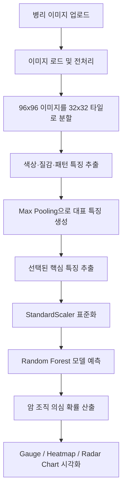

# DiagnosisAI


## 1. 프로젝트 개요

**DiagnosisAI**는 림프절 병리 조직 이미지 패치를 기반으로 전이성 암 조직 여부를 예측하는 머신러닝 기반 웹 애플리케이션입니다.

사용자가 96×96 픽셀 크기의 병리 이미지 패치(`.tif`, `.png`, `.jpg`)를 업로드하면, 시스템은 이미지에서 색상, 질감, 미세 패턴 특징을 추출한 뒤 학습된 Random Forest 모델을 이용해 암 조직 의심 확률을 계산합니다. 예측 결과는 Streamlit 웹 화면에서 위험도 게이지, 핵심 지표 그래프, 구역별 위험도 Heatmap, Radar Chart 형태로 시각화됩니다.

> ⚠️ 본 프로젝트는 연구 및 학습 목적의 프로토타입입니다. 실제 임상 진단, 치료 결정, 의료 판단을 대체할 수 없으며, 최종 판단은 반드시 병리 전문의 등 의료 전문가의 검토가 필요합니다.

---

## 2. 프로젝트 주제

- **과제명**: 림프절 데이터를 통한 암전이 조직 예측
- **분석 대상**: 림프절 병리 조직 이미지 패치
- **예측 목표**: 정상 조직과 전이성 암 조직의 이진 분류
- **입력 데이터**: 96×96 픽셀 RGB 병리 이미지
- **출력 결과**: 암 조직 의심 확률 및 정상/암 의심 판정
- **모델 방식**: 이미지 특징 추출 기반 Random Forest 분류 모델

---

## 3. 주요 기능

### 이미지 업로드 및 분석

- `.tif`, `.png`, `.jpg` 형식의 병리 이미지 업로드
- 96×96 이미지 패치를 32×32 타일 단위로 분할
- 배경 영역을 제외하고 조직 영역 중심으로 특징 추출
- 타일별 특징을 Max Pooling 방식으로 통합

### 특징 추출

- RGB 색상 특징
- HSV 색상 공간 특징
- LAB 색상 공간 특징
- GLCM 기반 질감 특징
- LBP 기반 미세 패턴 특징

### 모델 예측

- StandardScaler를 이용한 입력 특징 표준화
- 선택된 핵심 특징만 모델 입력값으로 사용
- Random Forest 모델을 이용한 암 조직 의심 확률 산출
- 임계값 기반 정상/암 조직 의심 판정

### 시각화

- 암 발생 위험도 Gauge Chart
- 핵심 특징 Bar Chart
- 9개 구역 기반 Regional Heatmap
- 정상/암 조직 기준과 현재 이미지 비교 Radar Chart
- 지표별 상세 해석 리포트

---

## 4. 데이터셋

본 프로젝트는 Kaggle의 **Histopathologic Cancer Detection** 데이터셋을 기반으로 구성되었습니다.

- 데이터 유형: 림프절 병리 조직 이미지 패치
- 이미지 크기: 96×96 픽셀
- 이미지 채널: RGB
- 파일 형식: `.tif`
- 라벨 구조:
  - `0`: 정상 조직
  - `1`: 전이성 암 조직
- 데이터 규모: 약 22만 장의 이미지 패치

데이터셋 자체는 저장소에 포함하지 않습니다. 데이터 사용 시 Kaggle 데이터셋의 이용 조건과 라이선스를 확인해야 합니다.

---

## 5. 분석 파이프라인



---

## 6. 특징 추출 방식

### 6.1 색상 특징

이미지를 RGB, HSV, LAB 색공간에서 분석하여 각 채널의 평균과 표준편차를 계산합니다. 병리 이미지는 염색 상태와 조직 구성에 따라 색상 분포가 달라지므로, 색상 기반 특징은 암 조직의 비정상적인 염색 패턴이나 핵 밀도 변화를 포착하는 데 사용됩니다.

예시 특징:

| 특징 | 의미 |
|---|---|
| `R_mean`, `G_mean`, `B_mean` | RGB 채널 평균값 |
| `R_std`, `G_std`, `B_std` | RGB 채널 표준편차 |
| `H_mean`, `S_mean`, `V_mean` | HSV 채널 평균값 |
| `H_std`, `S_std`, `V_std` | HSV 채널 표준편차 |
| `L_mean`, `A_mean`, `B_mean` | LAB 채널 평균값 |
| `L_std`, `A_std`, `B_std` | LAB 채널 표준편차 |

### 6.2 질감 특징

GLCM, 즉 Gray-Level Co-occurrence Matrix를 이용해 조직의 질감적 특성을 계산합니다. 암 조직은 정상 조직보다 구조가 불규칙하게 나타날 수 있기 때문에 질감 대비와 균일성은 중요한 판별 지표가 됩니다.

| 특징 | 의미 |
|---|---|
| `GLCM_Contrast` | 픽셀 간 밝기 차이와 질감 대비 |
| `GLCM_Homogeneity` | 조직 질감의 균일성 |
| `GLCM_Energy` | 질감 패턴의 규칙성과 에너지 |
| `GLCM_Correlation` | 인접 픽셀 간 상관성 |

### 6.3 패턴 특징

LBP, 즉 Local Binary Pattern을 이용하여 세포와 조직의 국소적인 미세 패턴을 수치화합니다. 이는 육안으로 구분하기 어려운 미세한 형태 차이를 모델 입력값으로 변환하는 역할을 합니다.

예시 특징:

- `LBP_0 ~ 9`
  
---

## 7. 최종 핵심 지표

보고서 기준으로 다중공선성 제거 후 암전이 예측에 사용된 주요 특징은 다음과 같습니다.

| 핵심 지표 | 설명 |
|---|---|
| `H_std` | HSV 색공간의 Hue 표준편차로, 색상 채널 변이를 의미 
| `B_std` | LAB 색공간의 B 채널 표준편차로, 색 농도 편차를 의미 |
| `GLCM_Contrast` | 조직 질감의 대비 및 불규칙성을 반영 |
| `GLCM_Energy` | 조직 질감의 균일성과 규칙성을 반영 |
| `LBP_4` | 국소 이진 패턴 기반 미세 형태 특징 |

실제 애플리케이션에서는 `selected_features.pkl`에 저장된 선택 특징 인덱스를 불러와 모델 입력값으로 사용합니다.

---

## 8. 모델 학습 개요

본 프로젝트는 이미지에서 직접 딥러닝을 수행하는 방식이 아니라, 병리 이미지 패치에서 정량적 특징을 추출한 뒤 머신러닝 모델을 학습하는 방식입니다.

전체 흐름은 다음과 같습니다.

1. 이미지 파일과 라벨 메타데이터 로드
2. 96×96 이미지 패치에서 32개 특징 추출
3. Train/Validation/Test 데이터 분할
4. 다중공선성 확인 및 VIF 기반 특징 제거
5. StandardScaler를 이용한 특징 표준화
6. 클래스 불균형 완화를 위한 SMOTE 적용
7. Random Forest 기반 분류 모델 학습
8. Validation Set에서 성능 비교 및 하이퍼파라미터 튜닝
9. Test Set에서 혼동행렬, Precision, Recall, F1-score, ROC-AUC 평가
10. 예측 임계값 최적화 후 웹 애플리케이션 적용

---

## 9. 모델 성능 및 임계값

보고서 기준 최종 모델은 ROC Curve에서 **AUC = 0.8627** 수준의 성능을 보였으며, 웹 애플리케이션에서는 예측 확률 기준 임계값을 **0.4380**으로 설정하여 정상 조직과 암 조직 의심군을 구분합니다.

| 항목 | 값 |
|---|---|
| 모델 | Random Forest |
| 전처리 | StandardScaler |
| 클래스 불균형 처리 | SMOTE |
| 주요 평가 지표 | ROC-AUC, Precision, Recall, F1-score |
| ROC-AUC | 0.8627 |
| 예측 임계값 | 0.4380 |

판정 기준은 다음과 같습니다.

| 예측 확률 | 판정 |
|---|---|
| `prob > 0.4380` | 암 조직 의심 |
| `prob <= 0.4380` | 정상 조직 가능성 높음 |

---

## 10. 웹 애플리케이션 화면 구성

Streamlit 앱은 다음과 같은 화면 요소로 구성됩니다.

| 화면 요소 | 설명 |
|---|---|
| 이미지 업로드 | 분석할 병리 조직 이미지 업로드 |
| 원본 이미지 표시 | 업로드한 병리 이미지 확인 |
| 판독 결과 | 정상 조직 가능성 또는 암 조직 의심 결과 출력 |
| 위험도 Gauge Chart | 암 조직 의심 확률을 0~100% 범위로 시각화 |
| 핵심 지표 Bar Chart | 선택 특징의 정규화 수치를 막대그래프로 표시 |
| Regional Heatmap | 96×96 이미지를 9개 구역으로 나누어 구역별 위험도 표시 |
| Radar Chart | 정상 조직 표준, 암 조직 표준, 현재 이미지의 특징 패턴 비교 |
| 상세 리포트 | H_std, B_std, GLCM_Contrast, GLCM_Energy, LBP_4 등 지표 해석 |

---

## 11. 프로젝트 파일 구조

권장 저장소 구조는 다음과 같습니다.

```text
DiagnosisAI/
├── README.md
├── app.py
├── requirements.txt
├── final_rf_model.pkl
├── scaler.pkl
├── selected_features.pkl
├── .gitignore
└── LICENSE
```

---

## 12. 파일 설명

| 파일명 | 설명 |
|---|---|
| `README.md` | 프로젝트 개요, 설치 방법, 실행 방법, 모델 설명을 담은 문서 |
| `app.py` | Streamlit 기반 암 조직 병리 슬라이드 판독 웹 애플리케이션 코드 |
| `requirements.txt` | 프로젝트 실행에 필요한 Python 패키지 목록 |
| `final_rf_model.pkl` | 학습된 Random Forest 모델 파일 |
| `scaler.pkl` | 모델 입력 특징을 표준화하기 위한 StandardScaler 객체 |
| `selected_features.pkl` | 최종 모델에 사용되는 선택 특징 인덱스 파일 |
| `.gitignore` | GitHub에 올리지 않을 파일과 폴더를 지정하는 설정 파일 |
| `LICENSE` | 오픈소스 라이선스 문서 |

---

## 13. 설치 방법

### 13.1 저장소 클론

```bash
git clone https://github.com/jechoi2026-00/DiagnosisAI.git
cd DiagnosisAI
```

### 13.2 가상환경 생성

Windows PowerShell 기준:

```bash
python -m venv .venv
.venv\Scripts\activate
```

macOS 또는 Linux 기준:

```bash
python -m venv .venv
source .venv/bin/activate
```

### 13.3 패키지 설치

```bash
pip install -r requirements.txt
```

만약 `requirements.txt`가 없다면 아래 패키지를 설치합니다.

```bash
pip install streamlit opencv-python-headless numpy pandas joblib plotly scikit-image scikit-learn imbalanced-learn
```

---

## 14. 실행 방법

아래 명령어를 실행하면 Streamlit 웹 애플리케이션이 시작됩니다.

```bash
streamlit run app.py
```

실행 후 브라우저에서 로컬 Streamlit 페이지가 열리면 분석할 병리 이미지를 업로드합니다.

일반적으로 접속 주소는 다음과 같습니다.

```text
http://localhost:8501
```

---

## 15. 사용 방법

1. Streamlit 앱을 실행합니다.
2. `판독할 96x96 조직 이미지(.tif, .png, .jpg)를 업로드하세요.` 영역에 이미지를 업로드합니다.
3. 앱이 이미지를 BGR/RGB 형식으로 로드하고 32×32 타일 단위로 분할합니다.
4. 각 타일에서 색상, 질감, 패턴 특징을 추출합니다.
5. 선택된 특징만 추출한 뒤 `scaler.pkl`을 이용해 표준화합니다.
6. `final_rf_model.pkl` 모델이 암 조직 의심 확률을 예측합니다.
7. 결과 화면에서 판정 결과와 위험도 시각화를 확인합니다.

---

## 16. 주요 코드 로직

### 16.1 32개 특징 추출

`get_32_features()` 함수는 32×32 이미지 패치에서 색상, 질감, 패턴 특징을 추출합니다.

```python
def get_32_features(patch):
    """32x32 패치에서 32개의 특징(색상, 질감, 패턴) 추출"""
```

추출되는 특징은 크게 세 가지입니다.

- RGB, HSV, LAB 색상 특징
- GLCM 기반 질감 특징
- LBP 기반 미세 패턴 특징

### 16.2 96×96 이미지 분석

`extract_logic_96x96()` 함수는 96×96 이미지를 32×32 타일 9개로 나누고, 배경 영역을 제외한 뒤 타일별 특징을 추출합니다.

```python
def extract_logic_96x96(img_bgr):
    """96x96 이미지를 32x32 타일로 나눠 분석 후 Max Pooling"""
```

### 16.3 모델 및 전처리 객체 로드

애플리케이션은 다음 세 가지 파일을 로드합니다.

```python
model = joblib.load('final_rf_model.pkl')
scaler = joblib.load('scaler.pkl')
selected_indices = joblib.load('selected_features.pkl')
```

### 16.4 예측 수행

```python
features_32 = extract_logic_96x96(img_bgr)
features_5 = features_32[selected_indices].reshape(1, -1)
input_scaled = scaler.transform(features_5)
prob = model.predict_proba(input_scaled)[0][1]
threshold = 0.4380
```

---

## 17. 기술 스택

| 구분 | 기술 |
|---|---|
| Language | Python |
| Web App | Streamlit |
| Image Processing | OpenCV |
| Feature Extraction | scikit-image |
| Machine Learning | scikit-learn Random Forest |
| Imbalance Handling | SMOTE |
| Data Processing | NumPy, pandas |
| Model Serialization | joblib |
| Visualization | Plotly |
| Dataset | Kaggle Histopathologic Cancer Detection |

---

## 18. 한계점

- 현재 모델은 연구용 프로토타입이며 실제 임상 진단용 모델이 아닙니다.
- 입력 이미지가 96×96 크기라는 전제를 갖고 있으므로, 다른 크기의 이미지는 별도 리사이징 또는 타일링 전처리가 필요합니다.
- 병리 이미지의 염색 상태, 스캐너 품질, 조직 절편 상태에 따라 예측 결과가 달라질 수 있습니다.
- 모델은 Patch 단위 분석에 최적화되어 있으며, 전체 슬라이드 이미지(WSI)를 실시간으로 분석하려면 별도의 타일링 파이프라인이 필요합니다.
- 외부 검증 데이터셋, 병리 전문의 검증, 민감도/특이도 검증이 추가로 필요합니다.


---

## 29. 라이선스

This project is licensed under the MIT License.

자세한 내용은 `LICENSE` 파일을 참고하세요.

---

